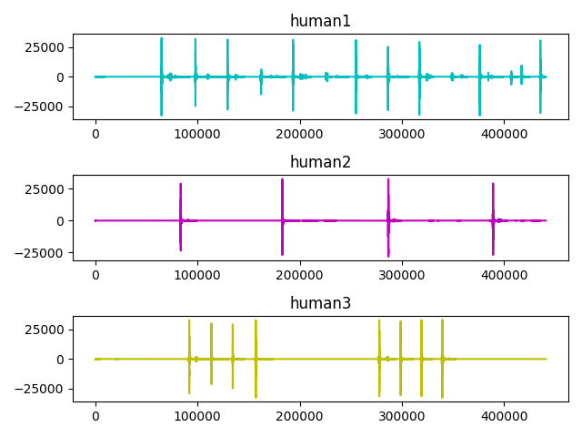

# audplot

## Installation
```
  $ pip install -r requirements.txt
```

## Usage
```
usage: audplot.py [-h] -d DURATION -c COUNT -n NAMES

optional arguments:
  -h,          --help                 show this help message and exit
  -d DURATION, --duration DURATION    recording duration
  -n NAMES,    --names    NAMES       list of name

```

## Example
```
  $ python audplot.py -d 5 -n human1,human2,human3
```


